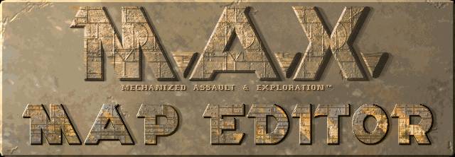

# M.A.X. Map Editor

A native map editor for **M.A.X.: Mechanized Assault & Exploration**
(Interplay, 1996) - written in Rust on wgpu + winit, for Linux and Windows.

I started this project because I never stopped wanting new planets to fight
over. The original maps are great, but after almost thirty years we know
them a little too well. This editor exists so we can finally draw our own -
and so that making a map is *enjoyable*, not an exercise in hex editing.

Made by a MAX Commander, for MAX Commanders, with 🖤 for M.A.X.

> **[Website & progress reports](https://suns-echoes.github.io/max-map-editor/)**
> · **[M.A.X. Port](https://klei1984.github.io/max/)** - the project that keeps
> the game itself alive and stable; if you don't know it yet, start there.
> · **[About the game](https://en.wikipedia.org/wiki/Mechanized_Assault_%26_Exploration)**

## Download

Grab the zip for your system from
**[Releases](https://github.com/suns-echoes/max-map-editor/releases)**, unzip
it anywhere, run `max-map-editor`. That's the whole install - settings live
beside the binary, nothing is written to your system.

- Point the editor at your M.A.X. directory: set `MaxPath` in
  `resources/user/config/mme.ini` (the [manual](./MANUAL.md) walks through
  everything).
- Linux: the optional `install.sh` adds a menu entry and icons. The editor
  runs fine without it.

## What it does today

- opens the original `.WRL` maps and exports game-ready ones - round-trips
  are byte-exact, verified against all 24 original maps;
- layered map projects with tile packs for all five terrains
  (green, desert, snow, crater, dark snow) - the 24 originals ship as
  ready-to-edit starter templates;
- tile painting with variants randomization, flood fill, and an
  **auto-shore** solver that draws correct water/land transitions for you;
- passability editor - paint the movement data, see it as an overlay;
- palette editor with live color cycling, range retints, palette
  save/load and hot-swap;
- **in-game preview**: palette cycling + 6-bit color, with an optional CRT
  effect for the full 1996 feeling;
- **unit previews**: stamp real units and buildings from your game data on
  the map (team colors, turrets, shadows) to judge palette edits against
  the art that will stand on it;
- **random terrain generator**: islands, continents, land masses, or
  river-cut worlds from a seed - tune water/obstruction/decoration balance,
  reroll until it looks right, abort mid-run; obstructions stamp as whole
  formations (mountain ranges, forests), not single tiles;
- a workspace you can rearrange - dockable panels, floating windows,
  multiple maps open in tabs, minimap, tile explorer;
- map from image: turn any picture into a map (quantization + dithering);
- full undo/redo, and a console where every editor action is a typed
  command - bindable, scriptable, replayable;
- a hand-machined UI that behaves like a desktop app should: every control
  answers the cursor, a mis-click can be cancelled by dragging off the
  button, and no text ever spills out of its window.

## What's planned

- terrain templates and adjacent-tile suggestions, so mountains stop being
  homework;
- custom tile packs and the tooling to build them;
- installing finished maps straight into your game.

Only time will tell what else.

## Building from source

You need stable Rust (edition 2024). On Debian/Ubuntu, wgpu/winit want:

```sh
sudo apt-get install -y libwayland-dev libxkbcommon-dev libx11-dev \
  libxcursor-dev libxrandr-dev libxi-dev
```

Then:

```sh
cargo build --release     # -> target/release/max-map-editor
cargo run                 # debug build, opens the starter map
cargo run -- MAP.WRL      # open a document (.WRL or project .json)
```

## Developing & testing

Every edit flows through a single `Command` mutator, which makes the editor
fully scriptable and headless-testable - see [ARCHITECTURE.md](./ARCHITECTURE.md)
for the tour, and [UI.md](./UI.md) for how the interface is built (the
widget kit, the interaction model, and the rules that keep it consistent).
The scripts under `scripts/` double as the regression suite:

```sh
cargo test --workspace                                 # everything
cargo run -- --script scripts/smoke.script --headless  # replay one script
cargo fmt                                              # always, before committing
```

Tests that compare against the original game maps look for them in
`testdata/originals/` (not in the repo - they're copyrighted game data).
`tools/fetch-testdata.sh MAX_DIR` copies them from your own install; without
them those tests skip and say so.

## License

The editor is MIT - see [LICENSE](./LICENSE).

Copyright © 2024-2026 Aneta Suns

---

M.A.X. COPYRIGHT © 1996 INTERPLAY PRODUCTIONS. ALL RIGHTS RESERVED.
INTERPLAY PRODUCTIONS IS THE EXCLUSIVE LICENSEE AND DISTRIBUTOR.
This project ships no original game content.
