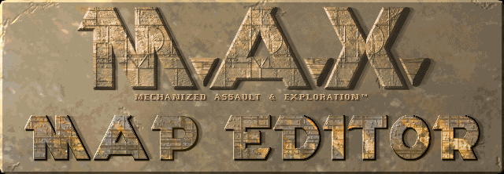

# M.A.X. Map Editor

A native map editor for **M.A.X.: Mechanized Assault & Exploration**
(Interplay, 1996) - written in Rust on wgpu + winit, for Linux and Windows.

I started this project because I never stopped wanting new planets to fight
over. The original maps are great, but after almost thirty years we know
them a little too well. This editor exists so we can finally draw our own -
and so that making a map is *enjoyable*, not an exercise in hex editing.

Made by a MAX Commander, for MAX Commanders, with 🖤 for M.A.X.

> **[Website & progress reports](https://suns-echoes.github.io/max-map-editor/)**
> · **[M.A.X. Port](https://klei1984.github.io/max/)** - the project that keeps
> the game itself alive and stable; if you don't know it yet, start there.
> · **[About the game](https://en.wikipedia.org/wiki/Mechanized_Assault_%26_Exploration)**

## Download

Grab the zip for your system from
**[Releases](https://github.com/suns-echoes/max-map-editor/releases)**, unzip
it anywhere, run `max-map-editor`. That's the whole install - settings live
beside the binary, nothing is written to your system.

- Point the editor at your M.A.X. directory: set `MaxPath` in
  `resources/user/config/mme.ini` (the [manual](./MANUAL.md) walks through
  everything).
- Linux: the optional `install.sh` adds a menu entry and icons. The editor
  runs fine without it.

## What it does today

- opens the original `.WRL` maps and exports game-ready ones - round-trips
  are byte-exact, verified against all 24 original maps; a foreign `.WRL`
  can be imported onto the tile packs you choose and edited as a project;
- layered map projects with tile packs for all five terrains
  (green, desert, snow, crater, dark snow) - the 24 originals ship as
  ready-to-edit starter templates;
- tile painting with variants randomization, flood fill, a sizable
  pencil/eraser, and a **terrain brush** that turns a free-hand land/water
  mask into terrain;
- **auto-shore**: water/land transitions - beach and cliff ladder - draw
  themselves;
- **scenery objects**: mountains, tree stands, cliffs, rocky outcrops and
  meadows placed as *objects* rather than wallpaper - by pixel, not by cell,
  with shared shadows and four ways two of them can overlap (the `higher`
  blend reads how tall each piece stands, so a hill interlocks with a
  mountain's flank); your own art can join the library, snapped to the map's
  palette. It all composites into the export - the game sees ordinary tiles;
- selection, copy/cut/paste, and reusable **templates** of anything you
  built, rotated and flipped on the way down;
- passability editor - paint the movement data, see it as an overlay - plus
  a validator that flags the cells the game would trip over;
- palette editor with live color cycling, range retints, palette
  save/load and hot-swap;
- **in-game preview**: palette cycling + 6-bit color, with an optional CRT
  effect for the full 1996 feeling;
- **unit previews**: stamp real units and buildings from your game data on
  the map (team colors, turrets, shadows) to judge palette edits against
  the art that will stand on it;
- **random terrain generator**: islands, continents, land masses, or
  river-cut worlds from a seed - tune water/obstruction/decoration balance,
  reroll until it looks right, abort mid-run; obstructions stamp as whole
  formations (mountain ranges, forests), not single tiles;
- **saved games (experimental)**: a `.DTA` opens as an ordinary editable map
  with every unit, building and slab where you left it in its team's colors;
  an inspector edits an object in place (team, name, facing, orders, hits,
  ammo, cargo, max values), the resource distribution is paintable and drawn
  with the game's own survey markers, and it writes back - an untouched save
  comes out byte-identical, an overwrite rotates the previous five away, and
  *New Save From Map* synthesizes one from a map you just drew;
- a workspace you can rearrange - dockable panels, floating windows,
  multiple maps open in tabs, minimap, tile explorer;
- map from image: turn any picture into a map (quantization + dithering);
- full undo/redo, and a console where every editor action is a typed
  command - bindable, scriptable, replayable;
- a hand-machined UI that behaves like a desktop app should: every control
  answers the cursor, a mis-click can be cancelled by dragging off the
  button, and no text ever spills out of its window.

## What's planned

- terrain templates and adjacent-tile suggestions, so mountains stop being
  homework;
- custom tile packs and the tooling to build them;
- installing finished maps straight into your game.

Only time will tell what else.

## Building from source

You need stable Rust (edition 2024). On Debian/Ubuntu, wgpu/winit want:

```sh
sudo apt-get install -y libwayland-dev libxkbcommon-dev libx11-dev \
  libxcursor-dev libxrandr-dev libxi-dev
```

Then:

```sh
cargo build --release     # -> target/release/max-map-editor
cargo run                 # debug build, opens the starter map
cargo run -- MAP.WRL      # open a document (.WRL or project .json)
```

## Branches

```
ft/<topic>  ->  dev  ->  main  ->  GitHub
```

- **`ft/<topic>`** - where work happens. It either merges into `dev` or is
  dropped; nothing else is a destination.
- **`dev`** - integration. The only branch that reaches `main`.
- **`main`** - the release branch, squash-built one commit per release, and the
  only ref pushed to the public repository. Committing there needs `RELEASE=1`,
  so cutting a release is deliberate rather than accidental.

`scripts/initialize.sh` installs hooks that enforce this, and pins the public
remote's push refspec to `main`. Re-run it after pulling changes to
`.githooks/` - the hooks are copied into `.git/hooks` rather than referenced in
place, because `main` does not contain `.githooks/` and a reference would
disarm itself the moment you checked `main` out.

## Developing & testing

Every edit flows through a single `Command` mutator (`EditorState::execute`),
which makes the editor fully scriptable and headless-testable: a session is a
list of commands, and a list of commands is a test. The interface is built
entirely from the first-party `wgpu-ui` retained-widget toolkit vendored at
`crates/wgpu-ui`. The scripts under `app/tests/scripts/` double as the
regression suite - they sit beside the harness that replays them, the way
`app/tests/snapshots/` sits beside the visual tests.

```sh
scripts/initialize.sh                                  # once per machine, after cloning
cargo fmt --all                                        # always, before committing
cargo clippy --all-targets --no-deps -- -D warnings    # the lint gate
cargo test --workspace                                 # everything
cargo run -- --script app/tests/scripts/smoke.script --headless   # replay one
```

Alongside the scripts, each parser that reads a file someone else may have
written carries a panic-freedom sweep - deterministic, dependency-free, and
about four seconds for the lot:

```sh
cargo test -p json --test fuzz          # JSON documents
cargo test -p map-core --test fuzz      # templates
cargo test -p ini --test fuzz           # mme.ini, the MAX.RES manifest
cargo test -p max-assets --test image_fuzz --test save_fuzz  # sprites, .DTA saves
```

### Fixtures, and the one way a green run can lie

The strongest proofs compare against the real game's files, which are
copyrighted and so **not** in the repo:

| suite | wants |
|---|---|
| 24-map equivalence proof (`map-core`) | `testdata/originals/`, or `MAX_DIR` |
| script suite (`max-map-editor`) | `testdata/originals/GREEN_1.WRL` |
| byte-exact save round trip + repair no-ops (`max-assets`) | saves in your `~/MAX` install |

`tools/fetch-testdata.sh MAX_DIR` copies the maps out of your own install.

Without them these suites skip - and a skip is reported as a **pass**. The
notice they print goes to stderr, which the test harness captures and discards
for passing tests, so a fresh clone shows a fully green gate with the heaviest
proofs silently doing nothing (the script suite finishing in 0.00 s instead of
~70 s is the only visible tell). On any machine where the files are supposed to
exist, run:

```sh
MAX_REQUIRE_FIXTURES=1 cargo test --workspace   # a skipped proof is now a failure
```

Everything else - the visual-regression baselines, the converted maps and tile
packs the shore proof reads - is committed, so a bare clone runs the whole rest
of the suite green with nothing else fetched.

## License

The editor is MIT - see [LICENSE](./LICENSE).

Copyright © 2024-2026 Aneta Suns

---

M.A.X. COPYRIGHT © 1996 INTERPLAY PRODUCTIONS. ALL RIGHTS RESERVED.
INTERPLAY PRODUCTIONS IS THE EXCLUSIVE LICENSEE AND DISTRIBUTOR.
This project ships no original game content.
